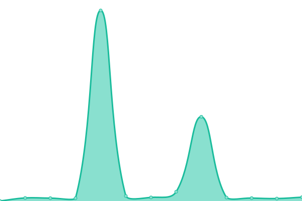
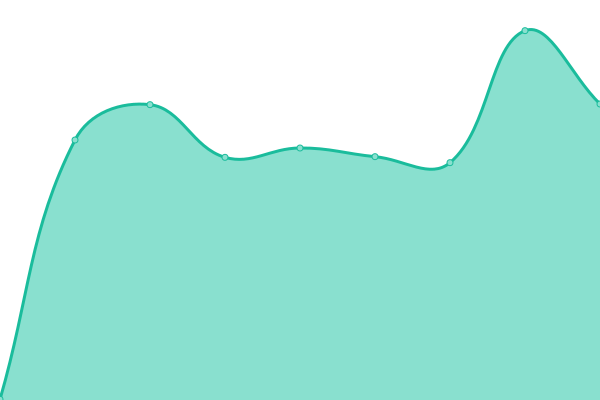

# [📈 Live Status](https://ildella.github.io/frankie-gpt): <!--live status--> **🟩 All systems operational**

This repository contains the open-source uptime monitor and status page for [Daniele Dellafiore](https://ildella.net), powered by [Upptime](https://github.com/upptime/upptime).

With [Upptime](https://upptime.js.org), you can get your own unlimited and free uptime monitor and status page, powered entirely by a GitHub repository. We use [Issues](https://github.com/ildella/frankie-gpt/issues) as incident reports, [Actions](https://github.com/ildella/frankie-gpt/actions) as uptime monitors, and [Pages](https://ildella.github.io/frankie-gpt) for the status page.

<!--start: status pages-->
<!-- This summary is generated by Upptime (https://github.com/upptime/upptime) -->
<!-- Do not edit this manually, your changes will be overwritten -->
<!-- prettier-ignore -->
| URL | Status | History | Response Time | Uptime |
| --- | ------ | ------- | ------------- | ------ |
|  [Frankie-GPT Chat](https://chat.frankie-gpt.com) | 🟩 Up | [frankie-gpt-chat.yml](https://github.com/ildella/frankie-gpt/commits/HEAD/history/frankie-gpt-chat.yml) | 

 632ms
     
 | 

<a href="https://ildella.github.io/frankie-gpt/history/frankie-gpt-chat">100.00%</a>
    

|  [Frankie-GPT Website](https://frankie-gpt.com) | 🟩 Up | [frankie-gpt-website.yml](https://github.com/ildella/frankie-gpt/commits/HEAD/history/frankie-gpt-website.yml) | 

 721ms
     
 | 

<a href="https://ildella.github.io/frankie-gpt/history/frankie-gpt-website">100.00%</a>
    

<!--end: status pages-->

[**Visit our status website →**](https://ildella.github.io/frankie-gpt)

## 📄 License

- Powered by: [Upptime](https://github.com/upptime/upptime)
- Code: [MIT](./LICENSE) © [Daniele Dellafiore](https://ildella.net)
- Data in the `./history` directory: [Open Database License](https://opendatacommons.org/licenses/odbl/1-0/)
